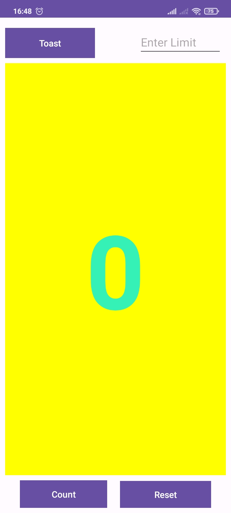
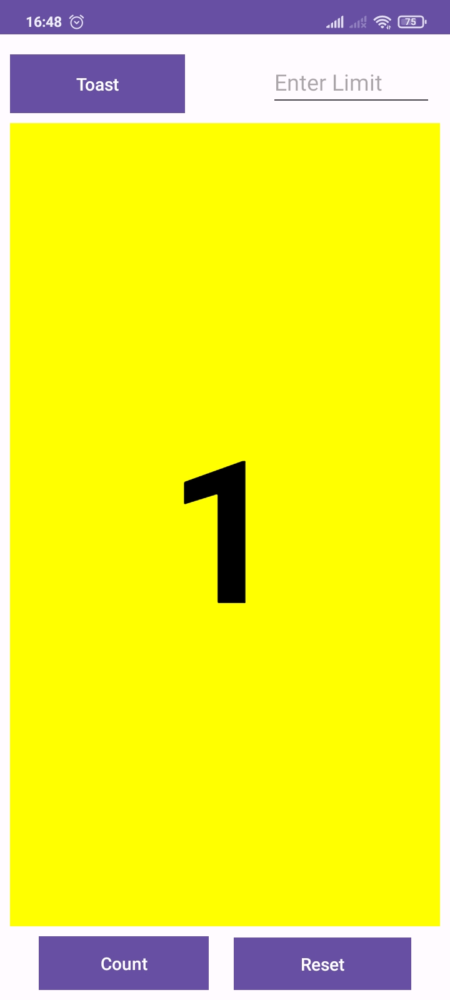
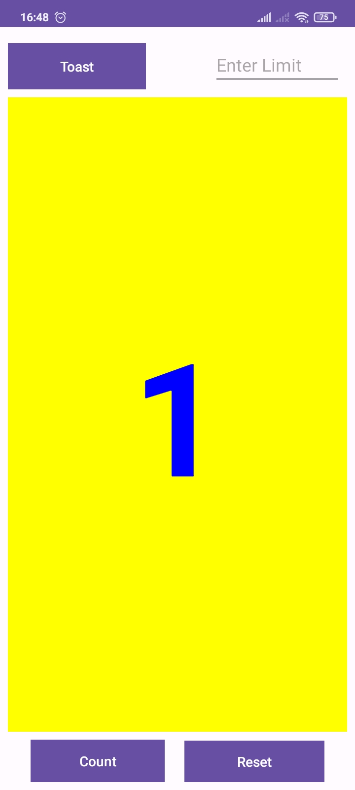
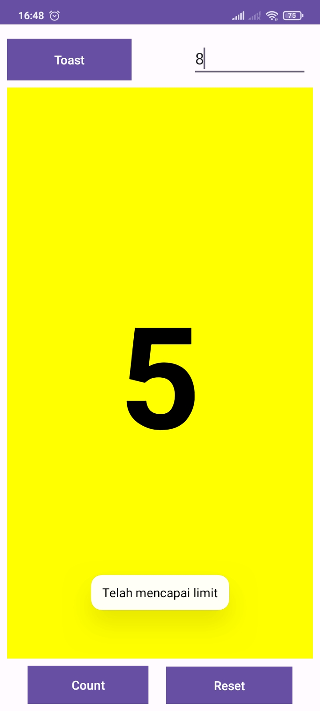

# Fibonacci Apps
Untuk mencoba aplikasinya dapat di [download](my-apps.apk) dan tekan **View Raw**.
## Tampilan Aplikasi





## Fitur Pada Aplikasi
- Tombol untuk menghitung fibonacci
- Tombol untuk mereset fibonacci
- Inputan untuk memasukan angka limitasi fibonacci
- Ketika tombol perhitungan fibonacci diklik, per klik mengganti warna

## Logika Pemrograman
### Logika Tombol Count dan Input Limitasi
```java 
public void countUp(View view) {
    EditText inputLimit = findViewById(R.id.input_limit);
    if(!inputLimit.getText().toString().isEmpty()) {
        int limit = Integer.parseInt(inputLimit.getText().toString());
        if(mCount >= limit) {
            Toast.makeText(this, "Telah mencapai limit", Toast.LENGTH_LONG).show();
            return;
        }
    }
    int next = mCount;
    mCount = secondCount;
    secondCount = next + mCount;
    if (mShowCount != null) {
        mShowCount.setTextColor(setColor());
        mShowCount.setText(Integer.toString(next));
    }
}

public int setColor() {
    currentFib++;
    if(currentFib % 2 == 0) {
        return ContextCompat.getColor(this, R.color.black);
    } else {
        return ContextCompat.getColor(this, R.color.blue);
    }
}
```
> Ketika tombol **count** diklik, Ketika angka limitasi tidak ditentukan, pengkondisian akan bernilai **false** dan akan mengeksekusi variabel **next** menyimpan nilai awalan properti **mCount** yaitu nol, setelahnya properti **mCount** menyimpan nilai awalan properti **secondCount** dan properti **secondCount** menyimpan nilai dari properti **mCount** dan **next** yang dikalkulasikan. Setelah warna angka akan ditentukan oleh method **setColor()** dan angka fibonacci akan ditampilkan melalui variabel **next**. Pada method **setColor()** angka akan berubah berdasarkan urutan angka tersebut, misalnya angka 0 ada pada index ke-0, angka 1 ada di index ke-1, angka 1 ada di index ke-2, dst berdasarkan pola fibonacci dan warna berubah berdasarkan nilai index ganjil-genap, index tersebut disimpan pada properti **currentFib**.

### Logika Tombol Reset
```java
public void reset(View view) {
    mCount = 0;
    secondCount = 1;
    if (mShowCount != null)
        mShowCount.setText(Integer.toString(mCount));
}
```
> Ketika tombol **reset** diklik, maka properti **mCount** dan **secondCount** diset ke nilai awal kembali.
